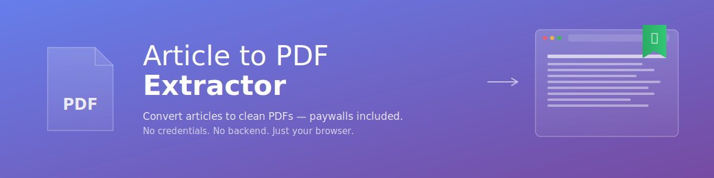

# Article to PDF Extractor

A browser-based tool that converts web articles into clean PDFs — including content behind paywalls you're already subscribed to.

No credentials. No backend. No server-side processing. No tracking. Just a single HTML file that runs in your browser.

[**Try the live demo →**](https://clhforensics.github.io/article-to-pdf-extractor/) *(replace `clhforensics` after enabling GitHub Pages)*

---

## Why this exists

Most "save article as PDF" tools fall into one of two camps:

1. **Browser print-to-PDF** — works for whatever you can see on screen, but pulls in nav bars, ads, sidebars, and awkward page breaks
2. **URL-fetching services** — clean output, but can't see paywalled content because they fetch from their own servers, not your authenticated browser

If you're a researcher, student, or journalist with legitimate subscriptions to publications like the *Wall Street Journal*, *New York Times*, JSTOR, *The Economist*, or similar, neither approach works well. And you shouldn't have to hand your credentials to a third-party tool to convert articles you already have access to.

This tool takes a different approach: a tiny bookmarklet runs inside your already-logged-in browser tab, extracts the article text, and hands it off to a local HTML tool for clean PDF generation. **Your credentials never leave your browser.**

## Features

- **🔖 Bookmarklet workflow** — one-click capture from any article page where you're already logged in
- **💾 Saved HTML upload** — drop in pages you've saved from your browser (`Ctrl+S` → "Webpage, HTML Only")
- **🔗 Public URL fetching** — for pages that don't require login, via public CORS proxies
- **🧠 Smart content extraction** — checks JSON-LD structured data, then semantic HTML selectors, then paragraph aggregation
- **📦 Batch processing** — queue multiple articles and generate all PDFs at once
- **📝 Plain text export** — `.txt` download alongside PDFs, useful for research workflows
- **🪶 Single file, ~52 KB** — no installation, no dependencies, no build step, works offline once loaded
- **🔒 Privacy-first** — no analytics, no tracking, no accounts, no server you have to trust

## Quick start

### Option A: Host it on GitHub Pages (recommended)

1. Fork this repo
2. Go to **Settings → Pages** and enable Pages from the `main` branch
3. Visit `https://clhforensics.github.io/article-to-pdf-extractor/`

### Option B: Run it locally

1. Download `index.html`
2. Double-click to open in your browser

That's it. No `npm install`, no build step, no configuration.

## Usage

### For paywalled articles (the main use case)

1. Open the tool. On the **Bookmarklet** tab, drag the green button onto your bookmarks bar.
2. Open the article in your browser, where you're already logged in. Wait for it to fully load.
3. Click the bookmark. You'll get a confirmation showing the title and character count.
4. Switch back to the tool and paste (`Ctrl+V`) into the textarea.
5. Click **Add to Queue**, then **Process All & Generate PDFs**.

### For saved HTML files

Save a webpage from your browser (`Ctrl+S` → "Webpage, HTML Only"), then drop the file in the **Saved HTML** tab. The same extraction logic applies.

### For public URLs

Paste a URL in the **URL Fetch** tab. The tool uses public CORS proxies to retrieve the page. Works for most public content but **will not** bypass paywalls or anti-bot protection.

## How it works

The bookmarklet is a small JavaScript snippet (~2.6 KB compacted) that runs in the page where you click it. When triggered, it:

1. Searches for `<script type="application/ld+json">` blocks and looks for `articleBody` — most major publishers include the full article in this structured data for search engines
2. Falls back to semantic selectors: `<article>`, `[itemprop="articleBody"]`, `[role="main"]`, `.article-body`, etc.
3. Falls back further to aggregating all `
` tags longer than 40 characters
4. Bundles title, URL, content, and a timestamp as JSON
5. Copies the result to your clipboard via the Clipboard API (with a `document.execCommand` fallback for older browsers)

The main tool auto-detects the bookmarklet's JSON payload when you paste, and queues it for PDF generation. PDF rendering uses [jsPDF](https://github.com/parallax/jsPDF), loaded from cdnjs.

## Privacy

- **No data leaves your browser** when using the Bookmarklet or Saved HTML workflows
- **No analytics, no telemetry, no cookies**
- **No accounts, no API keys, no signups**
- **No credentials are ever requested or stored** — by design, the tool never sees your login information

The only external request happens when you use the **URL Fetch** tab, which routes through public CORS proxies (`api.allorigins.win`, `corsproxy.io`, `thingproxy.freeboard.io`). Only use this for non-sensitive public pages, since those proxy services can see what you request.

jsPDF is loaded from `cdnjs.cloudflare.com`. To avoid the CDN entirely, [download jsPDF](https://github.com/parallax/jsPDF/releases) and replace the `<script src="...">` reference with a local path.

## Limitations

- **Shadow DOM content** — the bookmarklet can't see into closed shadow roots. Most major publishers don't use these for article body content, but some do
- **Paginated or lazy-loaded content** — scroll to the end before clicking the bookmarklet, so all paragraphs have rendered
- **Interactive embeds** — charts, videos, calculators, and widgets won't carry over; you get the prose
- **Images** — not yet extracted (text only)
- **Citation metadata** — currently captures title and URL only; no author or publication date extraction yet

## Roadmap

Possible future directions, roughly in priority order:

- [ ] Browser extension (Chrome / Edge / Firefox) for a true one-click experience without clipboard hops
- [ ] Citation metadata extraction (author, publication date, DOI) with BibTeX / RIS export
- [ ] Image extraction and inclusion in PDFs
- [ ] Combined multi-article PDF export
- [ ] Persistent queue via `localStorage`
- [ ] Better handling of shadow DOM and lazy-loaded content
- [ ] OPML / Zotero integration for research workflows

## Contributing

Issues and PRs welcome. A few notes for contributors:

- This is a deliberately single-file project — please keep changes self-contained
- No build step, no transpilation, no framework — vanilla JS targeting modern browsers
- Test the bookmarklet on at least two real article sites before submitting changes to extraction logic

## Acknowledgments

- [jsPDF](https://github.com/parallax/jsPDF) for client-side PDF generation
- The Schema.org community for `articleBody` JSON-LD, which makes extraction much easier than it has any right to be

## License

[MIT](LICENSE) © Article to PDF Extractor contributors
